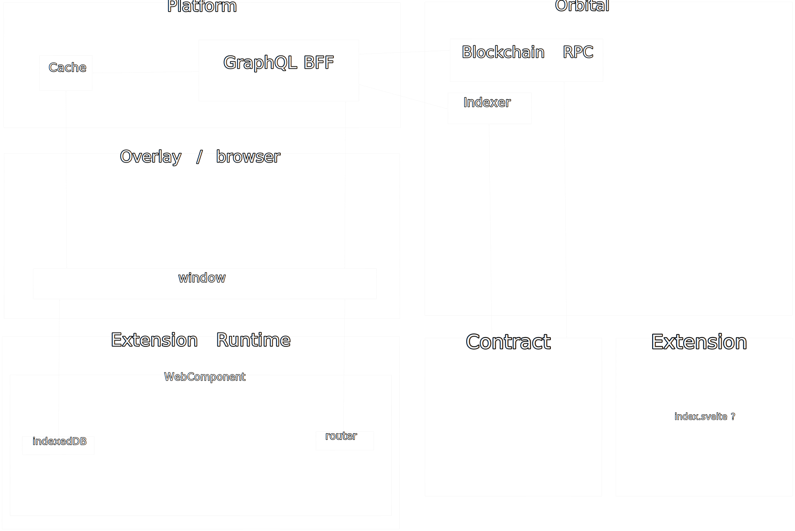

# AKAIA CommLink

Operating System for decentralized community-owned web.

## Development

### Prerequisites

Install Mise unless it's already installed:

<https://mise.jdx.dev/getting-started.html>

#### Ubuntu 24.04 requirements

```sh
sudo apt-get install build-essential pkg-config curl wget libglib2.0-dev libssl-dev libgtk-3-dev libappindicator3-dev librsvg2-dev libgdk3.0-cil libatk1.0-dev libssl-dev libgdk3.0-cil-dev libjavascriptcoregtk-4.1-dev libwebkit2gtk-4.1-dev nsis lld llvm
```

### Installing required tools and dependencies

```sh
bash -c "mise trust; mise i && cargo install just"; mise reshim; just setup
```

### Running development server

```sh
just dev
```

## CI/CD

### Building production bundle

```sh
just build
```

## Architecture


